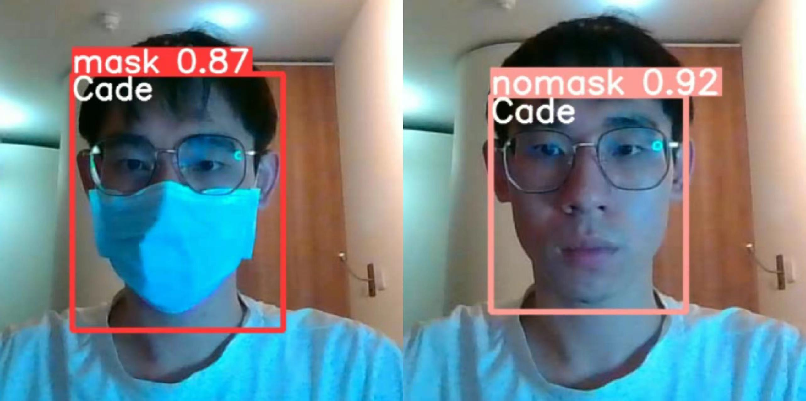
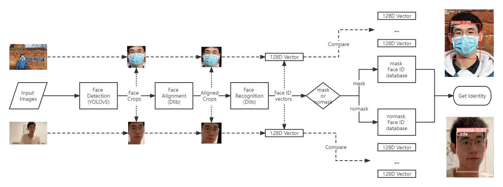
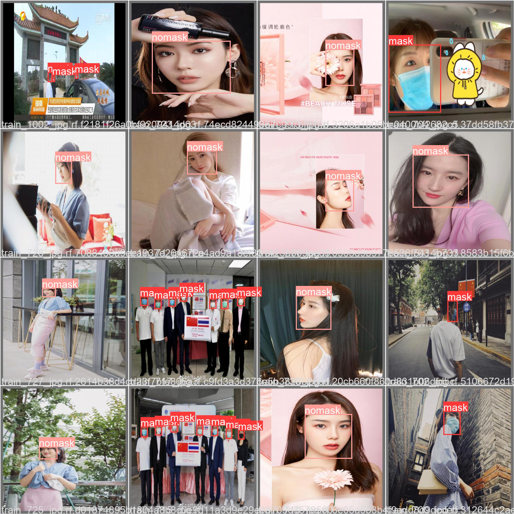
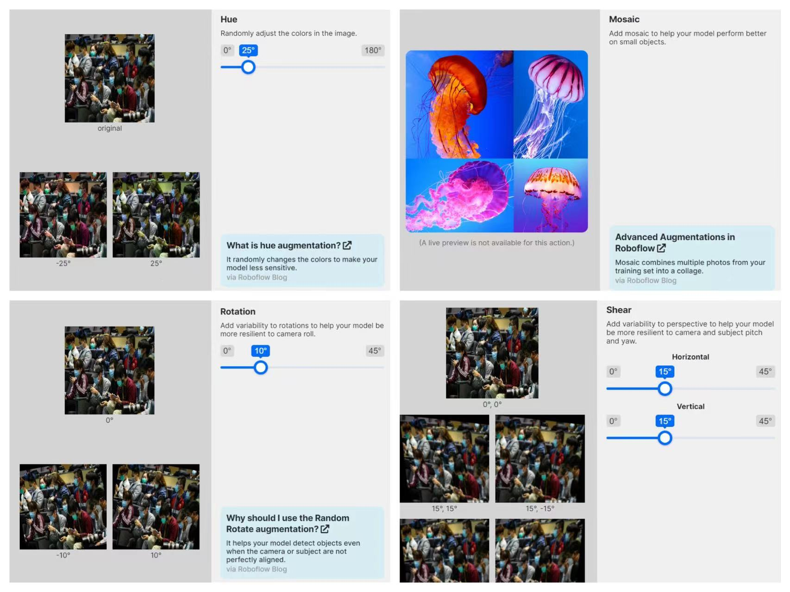
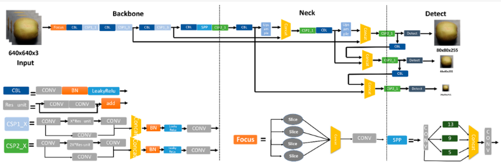
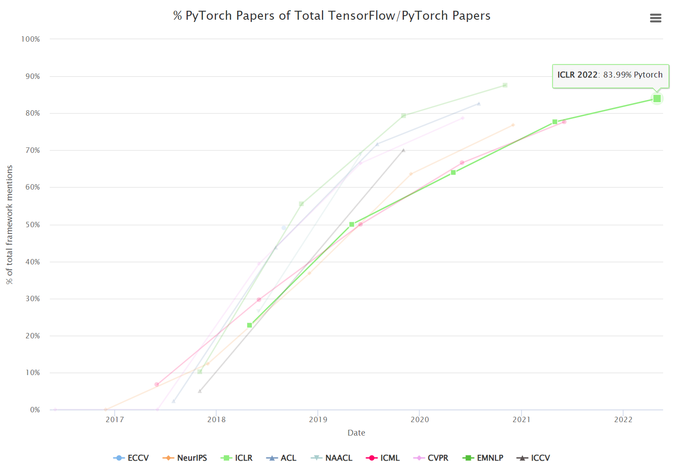
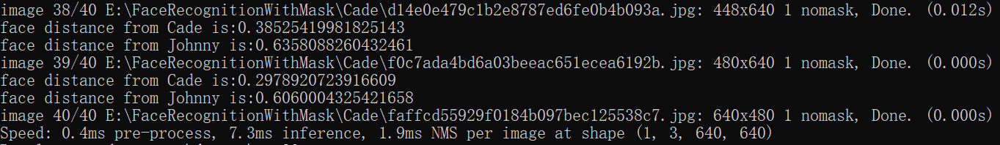
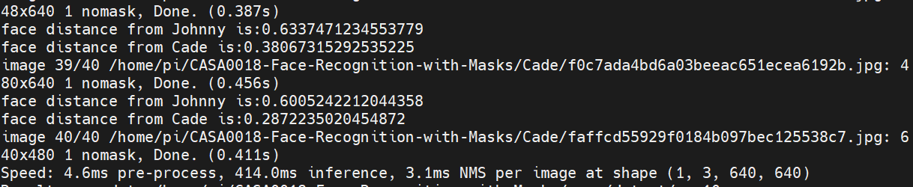
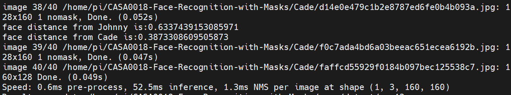

# Real-time Face Recognition With Masks on Raspberry Pi

Zixu Cheng (Cade), https://github.com/Cheng-Zixu/CASA0018-Face-Recognition-with-Masks

## Introduction

After the COVID-19 epidemic, wearing a mask has become a norm in people’s lives. People found they have to take off their masks when using the previous deep learning face recognition models. That’s because the coverings make the model unable to recognise their faces. It is very inconvenient for our daily life. We need to feed some faces with masks data when training our deep learning model to solve this problem.

In addition, deploying deep learning models on edge devices (like raspberry pi or phone) is a well-known problem. The DL model sometimes needs a powerful CPU/GPU to process high-resolution images for faster computation and to run a heavy model for higher accuracy, which is unavailable for edge devices. The deployment requires a trade-off between accuracy and latency if we want a real-time recognition (at least 15fps). Therefore, we need to find a lightweight deep learning model with a faster inference speed and a higher accuracy to deploy on our edge devices.

I design a “Real-time Face Recognition With Masks” project on the PC as well as Raspberry Pi by using YOLOv5 and Dlib models. YOLOv5 is used to detect faces or mask faces, and Dlib models are adopted to create face ID vectors. The face with the shortest vector distance will be matched.

Fig 1. Recognition results of my face mask recognition system

As a result, I achieved my system working at about 104fps on PC and above 15fps on Raspberry Pi.

## Research Question

Face Mask Detection: How to build a face mask detection model?

Face ID: How to create face IDs with masks and without masks and how to compare two face IDs?

## Application Overview

In this project, my face recognition with masks system consists of 3 steps(Masi et al., 2018):

1. Face detection: a face detector is used to localise faces in images or videos;

2. Face alignments: with the facial landmark detector, the faces are aligned to normalised canonical coordinates;

3. Deep Face Recognition: face recognition module consists of face processing, deep feature extraction and face matching.

Fig 2. Workflow of my Face Recognition with mask system

I used **YOLOv5(ultralytics, 2021)** to train an object detection model to detect faces with masks or without masks. Then, the face landmarks predictor in the **Dlib(King, 2009)** package was adopted to get 68 key points on faces and get the faces after alignment. Consequently, the face recognition model in Dlib would generate **Face ID vectors (or Face Embeddings)** for the faces. Finally, the face vectors would be compared to the Face IDs in different databases (mask/nomask) to recognise your identity according to the detection result. I applied **L2 Distance (or Euclidean Distance)** to calculate the distance between two face IDs. In addition, you need to upload your face with a mask and without a mask to generate Face IDs first in the Face database for recognition.

## Data

The dataset I used to train the face detection model is an open-sourced face mask dataset. It contains about 1600 images with about 5000 faces, and all images are resized to 640x640 resolution. The labels of each face are the face classification (mask and nomask) and the coordinates of the face bounding box (x, y, w, h). You can download and get more information or visualisation of the dataset here: https://universe.roboflow.com/zixu-cheng/face-recognition-with-mask/.

Fig 3. Examples of the face detection dataset

Previously, I split 75% of images as the training set and the rest of 25% as the validation set. To make good use of images to train the model, I test the model by using webcam data instead of images in the dataset. However, I found it is unreasonable to design experiments like this. Hence, I re-split the dataset as the training set, validation set and testing set, respectively containing 60%, 10%, and 30% of the data.

I also found the limitation of this dataset: Most of the data are Asian faces.  To figure out this problem, I introduced data augmentation of my dataset. Hue augmentation randomly adjusts the images’ colours to make the model less sensitive to skin colours. I also applied rotation, shear, and mosaic augmentation to help the model be more resilient to camera roll, subject pitch and yaw and perform better on small objects. You can get more augmentation information from [Roboflow](https://docs.roboflow.com/image-transformations/image-augmentation#augmentation).

Fig 4. The example results of the data augmentation I applied to my project

After data augmentation, the number of images in the trainset is tripled. The recall generally improved from about 70% to 90% after data augmentation in the follow-up experiments.

## Model

### YOLOv5

YOLOv5 is now one of the most popular object detection models because of its small model size, efficient inference speed and high accuracy. I choose this model because I believe its advantages can meet my requirements for real-time deployment on edge devices.

Fig 5. The constructure of YOLOv5 model(Yao et al., 2021)

It consists of 3 parts: backbone, neck and prediction head. Backbone contains a great amount of convolutional neural network layers to generate the feature maps of the input images. The neck uses a series of layers to mix and combine feature maps to fuse various kinds of image features. Head takes box and class prediction steps according to the image features from the neck. 

I train two versions of YOLOv5 for this project, YOLOv5n (a smaller one for Pi) and YOLOv5s(a larger one for PC). The difference in the configuration of these two models is the number of CNN layers in the backbone.

### Dlib

Dlib is an open-source toolkit that provides a high-quality face recognition model. I choose it because it is easy to use for a beginner to build a face recognition system from scratch. A 68 face landmarks predictor and a face recognition ResNet deep learning model are used for this project.

## Experiments

### Experiments Environments

OS: Windows 10 / Raspberry Pi OS(64-bit)

Platform: Python 3.8.8 Pytorch 1.9.1

GPU: RTX 3080 Laptop 16G VRAM (PC only)

### Why PyTorch

Open-sourced by Facebook, PyTorch is now one of the most popular deep learning frameworks because its unique features and capabilities. PyTorch has been widely used in academia and industry since 2018. In many top conferences of Computer Vision, like CVPR, ICCV and AAAI, the number of PyTorch papers is almost three to four times that of Tensorflow, according to the statistics of http://horace.io/pytorch-vs-tensorflow/. 

Fig 6. The proportion of pytorch in top conferences

Many new SOTA models are using PyTorch now, including YOLOv5. YOLOv5, first published in 2020, is open-source in the PyTorch version and is maintained by many developers. It would be easier for us to achieve our goals - Training a lightweight model with fast inference speed so that we can deploy it working in real-time if we use PyTorch flatform. 

### Experiments Design

I introduced some optimisation tricks and designed a series of ablation experiments to find a better model for my system. For tricks, the **Cosine-learning rate** schedule can search for the local optimal parameters. **Label smoothing** is a regularisation method to avoid overfitting when training an object detection model. **Multi-scale training** can improve the robustness of models for objects of various sizes. The metrics we used are precise and recall (for classification) and mAP (for box regression).

After getting Face ID vectors from face recognition model, I applied L2 Distance to calculate the distance between two face IDs.

## Results and Observations

### Detection training Results

For the YOLOv5s I trained for PC, Cos-lr gets the best results of precise, Cos-lr with label smoothing get the best results of recall, and multi-scale training gets the best results of mAP.

Table 1. The experiment results of YOLOv5s model

| exp  |  Model   |      input size      | parameter | GFLOPs | Precise     val/test | Recall     val/test | mAP     val/test | model size | cos-lr | label smoothing | multi-scale | train time(h) |
| :--: | :------: | :------------------: | :-------: | :----: | :------------------: | :-----------------: | :--------------: | :--------: | :----: | :-------------: | :---------: | :-----------: |
|  1   | YOLOv5-s |       640x640        |   7.0M    |  15.8  |     0.966/0.885      |     0.949/0.862     |   0.570/0.441    |   14.5MB   |        |                 |             |     3.373     |
|  2   | YOLOv5-s |       640x640        |   7.0M    |  15.8  |   0.960/**0.889**    |     0.969/0.843     |   0.578/0.442    |   14.5MB   |   ✔    |                 |             |     3.35      |
|  3   | YOLOv5-s |       640x640        |   7.0M    |  15.8  |     0.968/0.871      |     0.969/0.844     |   0.569/0.436    |   14.5MB   |        |        ✔        |             |     3.204     |
|  4   | YOLOv5-s | 320x320~     960x960 |   7.0M    |  15.8  |     0.958/0.883      |     0.963/0.848     | 0.564/**0.444**  |   14.5MB   |        |                 |      ✔      |     3.367     |
|  5   | YOLOv5-s |       640x640        |   7.0M    |  15.8  |     0.969/0.877      |   0.968/**0.865**   |   0.572/0.442    |   14.5MB   |   ✔    |        ✔        |             |     2.916     |
|  6   | YOLOv5-s | 320x320~     960x960 |   7.0M    |  15.8  |     0.956/0.865      |     0.953/0.846     |   0.551/0.431    |   14.5MB   |   ✔    |                 |      ✔      |     3.365     |
|  7   | YOLOv5-s | 320x320~     960x960 |   7.0M    |  15.8  |     0.954/0.871      |     0.948/0.832     |   0.562/0.421    |   14.5MB   |        |        ✔        |      ✔      |     3.355     |
|  8   | YOLOv5-s | 320x320~     960x960 |   7.0M    |  15.8  |      0.961/0.86      |     0.966/0.838     |    0.56/0.419    |   14.5MB   |   ✔    |        ✔        |      ✔      |     3.092     |

Table 2. The experiment results of YOLOv5n model

| exp  |  Model   |      input size      | parameter | GFLOPs | Precise     val/test | Recall     val/test | mAP     val/test | model size | cos-lr | label smoothing | multi-scale | train time(h) |
| :--: | :------: | :------------------: | :-------: | :----: | :------------------: | :-----------------: | :--------------: | :--------: | :----: | :-------------: | :---------: | :-----------: |
|  1   | YOLOv5-n |       640x640        |   1.8M    |  4.2   |     0.963/0.861      |     0.948/0.822     |   0.518/0.391    |   3.9MB    |        |                 |             |     3.154     |
|  2   | YOLOv5-n |       640x640        |   1.8M    |  4.2   |     0.954/0.856      |   0.953/**0.837**   | 0.516/**0.397**  |   3.9MB    |   ✔    |                 |             |     3.226     |
|  3   | YOLOv5-n |       640x640        |   1.8M    |  4.2   |     0.962/0.884      |     0.932/0.815     |   0.512/0.383    |   3.9MB    |        |        ✔        |             |     3.788     |
|  4   | YOLOv5-n | 320x320~     960x960 |   1.8M    |  4.2   |   0.958/**0.885**    |     0.944/0.799     |   0.496/0.387    |   3.9MB    |        |                 |      ✔      |     2.785     |
|  5   | YOLOv5-n |       640x640        |   1.8M    |  4.2   |     0.965/0.854      |     0.951/0.817     |   0.509/0.383    |   3.9MB    |   ✔    |        ✔        |             |     3.275     |
|  6   | YOLOv5-n | 320x320~     960x960 |   1.8M    |  4.2   |     0.952/0.880      |     0.94/0.811      |   0.485/0.383    |   3.9MB    |   ✔    |                 |      ✔      |     2.942     |
|  7   | YOLOv5-n | 320x320~     960x960 |   1.8M    |  4.2   |     0.948/0.851      |     0.933/0.814     |   0.504/0.386    |   3.9MB    |        |        ✔        |      ✔      |     3.542     |
|  8   | YOLOv5-n | 320x320~     960x960 |   1.8M    |  4.2   |     0.954/0.875      |     0.922/0.808     |   0.507/0.392    |   3.9MB    |   ✔    |        ✔        |      ✔      |     3.317     |

For the YOLOv5n I trained for Raspberry, multi-scale training gets the best results of precise and Cos-lr gets the best results of recall and mAP. 

I noticed tricks can sometimes improve the model’s performance but sometimes even worsen. However, as we all know, neural networks are black box models that are not interpretable. In my explanation and speculation, I think label smoothing is a regularisation method that might make the model underfitting. Multi-scale training makes input data more complex to promote the model’s robustness and improve its performance to some extent.

### Latency

On my PC, accelerated by GPU, using YOLOv5s to process per image (640x640) on average takes about 9.6ms(about 104fps) to get face mask recognition, including 0.4ms for image pre-processing, 7.3ms for inference (including detection and recognition) and 1.9ms for NMS (non-maximun Suppression).

Fig 7. The speed of precess per image on my laptop using YOLOv5s

However, things are quite different on the Raspberry Pi. If we still input the same size of images (640x640), using YOLOv5n to process per image on average takes about 421.7ms(about only 2.4fps) to get face mask recognition, including 4.6ms for image pre-processing, 414ms for inference and 3.1ms for NMS. 

Fig 8. The speed of precess per image on Raspberry Pi using YOLOv5n

To get our real-time purpose, we have to rescale the input image to 160x160. Although we accelerate it to 54.4ms(about 18.4fps) by doing this, we also sacrifice some accuracy of the model. You may find some images cannot be correctly recognised.

Fig 9. The speed of precess per image on Raspberry Pi using YOLOv5n in smaller image resolution

### Reflection

Despite our system working in real-time, there are still some shortcomings that could be improved. First, although applying Hue data augmentation can alleviate the problem of unbalanced race in my dataset, it’s better to add some new face data of other races. What's more, we still generate face ID vectors by using the whole face crops after face mask detection, which may increase the similarity of masked faces and cause a wrong recognition when wearing masks. Actually, all we need to focus on is the part without mask covering. In the latest research, we can solve this problem by introducing the attention mechanism(Hu et al., 2018; Woo et al., 2018) to make the neural network concentrate on the uncovered face area. Moreover, we can select other lighter models to deploy on Raspberry Pi, such as YOLOX(Ge et al., 2021), nanoDet(RangiLyu, 2021) and YOLO-fastest(dog-qiuqiu, 2021). I haven’t done these experiments because training a deep learning model really takes a lot of time(Every YOLOv5 model takes me about 3h to train). Finally, as far as I’m concerned, we may achieve faster deployment by applying some network slimming methods, such as quantisation, pruning and using the NCNN(Tencent, 2022) inference framework to accelerate. 

In addition, it would be more practical for my work if it could run on other deep learning frameworks, such as TensorFlow or TensorFlow Lite. How to deploy my system on Android or IOS devices could also be a challenge. I will figure out those issues if I have a chance to continue my research on them in future.

## Bibliography

1. Masi, I., Wu, Y., Hassner, T., & Natarajan, P. (2018). Deep face recognition: A survey. SIBGRAPI conference on graphics, patterns and images (SIBGRAPI): IEEE, 471-478.
2. dog-qiuqiu. (2021). Yolo-FastestV2. Github. https://github.com/dog-qiuqiu/Yolo-FastestV2
3. Ge, Z., Liu, S., Wang, F., Li, Z., & Sun, J. (2021). Yolox: Exceeding yolo series in 2021. arXiv preprint arXiv:2107.08430v2. https://doi.org/10.48550/arXiv.2107.08430
4. Hu, J., Shen, L., & Sun, G. (2018). Squeeze-and-excitation networks. Proceedings of the IEEE conference on Computer Vision and Pattern Recognition(CVPR): IEEE.
5. King, D. E. (2009). Dlib-ml: A machine learning toolkit. The Journal of Machine Learning Research, *10*, 1755-1758. 
6. RangiLyu. (2021). NanoDet-Plus: Super fast and high accuracy lightweight anchor-free object detection model. Github. https://github.com/RangiLyu/nanodet
7. Tencent. (2022). NCNN. Github. https://github.com/Tencent/ncnn
8. ultralytics. (2021). YOLOv5. Github. https://github.com/ultralytics/yolov5
9. Woo, S., Park, J., Lee, J.-Y., & Kweon, I. S. (2018). Cbam: Convolutional block attention module. Proceedings of the European conference on computer vision (ECCV). Springer.
10. Yao, J., Qi, J., Zhang, J., Shao, H., Yang, J., & Li, X. (2021). A Real-Time Detection Algorithm for Kiwifruit Defects Based on YOLOv5. *Electronics*, *10*(14), 1711. https://www.mdpi.com/2079-9292/10/14/1711

------

## Declaration of Authorship

I, Zixu Cheng, confirm that the work presented in this assessment is my own. Where information has been derived from other sources, I confirm that this has been indicated in the work.

20/04/2022